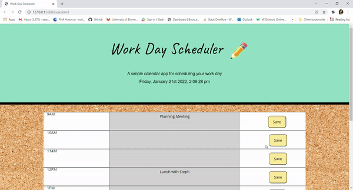

# 
 Working Day Planner 

  
 

  

 Link to deployed site: https://languagebytes.github.io/Working-Day-Planner/ 

## 
 Task 

This is a simple daily planner application. Its target audience is a busy schedule who wish to plan their working day.
The application displays the current date and time at the the top of the page and a timetable which they can tailor to their needs. The user is able to manually enter an event in the text area and save their changes by pressing the save button. This data will be saved in local storage on their device so they can refer back to it throughout the day.

## 
 Comments on Code 

Moment js is a shiny, new tool :). I think my code here is very repetitive and I'm sure there must be a much more concise solution. I will work on this in the coming weeks. In retrospect, I don't think using moment js for the first column was necessary, this could maybe be transferred to a p tag in the html.
